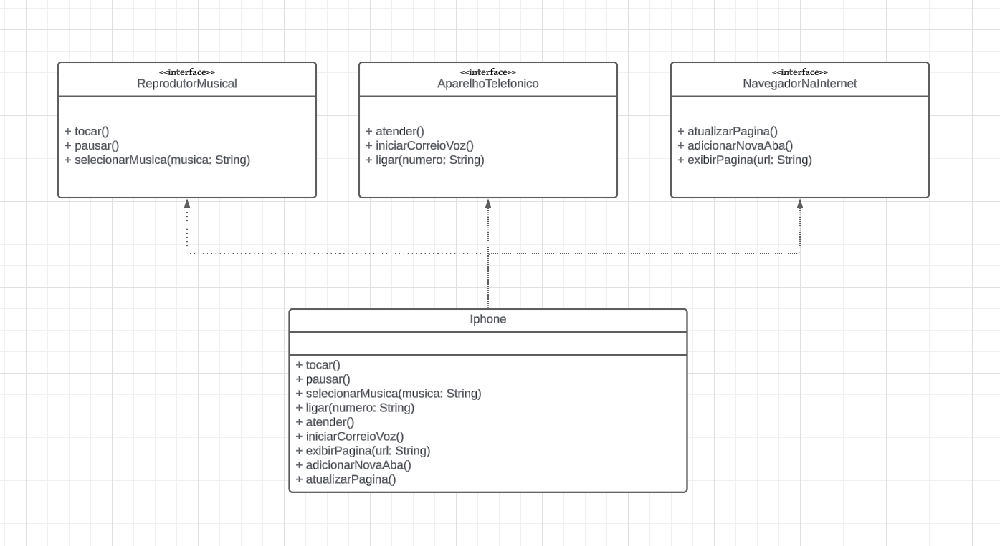

## PROTÓTIPO JAVA

 protótipo básico em Java:
 Interface ReprodutorMusical:

Métodos: tocar(), pausar(), selecionarMusica(String musica)
Interface AparelhoTelefonico:

Métodos: ligar(String numero), atender(), iniciarCorreioVoz()
Interface NavegadorInternet:

Métodos: exibirPagina(String url), adicionarNovaAba(), atualizarPagina()
Classe iPhone que implementa as três interfaces acima.

+-------------------+
|   ReprodutorMusical   |
+-------------------+
| + tocar()          |
| + pausar()         |
| + selecionarMusica(musica: String) |
+-------------------+

+-------------------+
|   AparelhoTelefonico  |
+-------------------+
| + ligar(numero: String)   |
| + atender()           |
| + iniciarCorreioVoz() |
+-------------------+

+-------------------+
|   NavegadorInternet  |
+-------------------+
| + exibirPagina(url: String)     |
| + adicionarNovaAba()          |
| + atualizarPagina()           |
+-------------------+

        ^
        |
        |
+-------------------+
|       iPhone        |
+-------------------+
| + tocar()          |
| + pausar()         |
| + selecionarMusica(musica: String) |
| + ligar(numero: String)   |
| + atender()           |
| + iniciarCorreioVoz() |
| + exibirPagina(url: String)     |
| + adicionarNovaAba()          |
| + atualizarPagina()           |
+-------------------+

